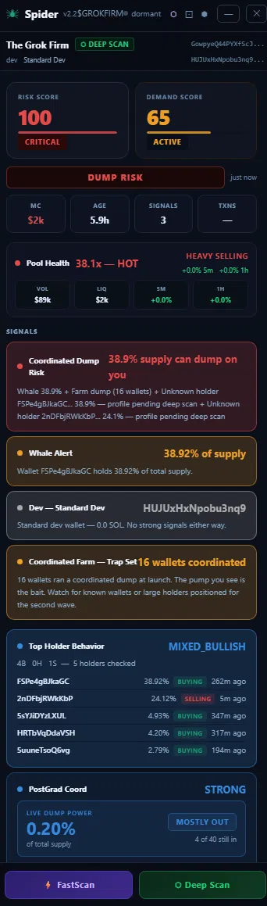
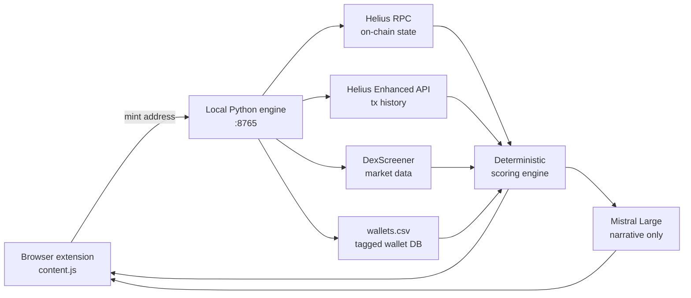

# Spider

**Real-time dump risk analysis for Solana memecoins.**

Spider answers one question, fast: *is enough supply sitting in dangerous hands to dump this token right now?*

It runs as a browser extension that injects a live intelligence panel directly into the trading platforms a trader already uses — Axiom, DexScreener, Photon, GMGN — backed by a local Python engine that reads on-chain state directly from Solana.

---

## The problem

Memecoin traders make entry decisions in seconds, with the worst possible information. The public dashboards show price, volume and a holder count — none of which tell you whether three wallets are holding 40% of supply and waiting for your buy pressure to exit into.

The data to answer that *is* on-chain. It's just not surfaced anywhere a trader can act on in time.

Spider surfaces it in the tab the trader is already looking at, in under a scan cycle.

---

## What it does

| | |
|---|---|
| **Supply concentration** | Every wallet above 5% of supply, resolved and ranked. No exemptions, no trust categories. |
| **Known-wallet matching** | Cross-references holders against a curated database of ~940 tagged Solana wallets — livestreamers, KOLs, developers, market makers, smart money. |
| **Token state classification** | Deterministic classification into one of seven states: `TRAP_SET`, `ACTIVE_THREAT`, `DISTRIBUTION`, `CONTESTED`, `CLEAN_ACCUMULATION`, `FARM_DEAD`, `UNKNOWN`. |
| **Lifecycle awareness** | A bonding-curve token and a graduated AMM token are different animals. Signals are filtered per lifecycle mode so pre-migration tokens aren't scored against metrics that don't exist yet. |
| **Narrative synthesis** | An LLM turns the computed picture into two or three sentences of plain trader English — and never touches a number. |

---

## Architecture

The extension is a thin client. It finds the mint address on the page, posts it to `localhost:8765`, and renders whatever comes back. All intelligence lives in the Python engine.

---

## Engineering decisions worth explaining

### Python owns every number. The LLM owns only prose.

This is the architectural law the whole system is built around. No percentage, count, score, threshold or classification is ever produced by the language model. The model receives a fully-computed result object and is asked for narrative — with a hard prompt constraint against restating figures.

The reason is simple: an LLM that hallucinates a holder percentage in a tool people trade against is worse than no tool. Separating the layers means the numbers are auditable and reproducible, and the model's failure mode degrades to "slightly awkward sentence" instead of "wrong number."

### Deterministic thresholds, not a model

Risk scoring is hard-coded thresholds — 5% per wallet to register, 30% aggregate for critical. No ML, no probabilistic scoring.

For this problem that's a feature. A trader needs to know *why* a signal fired, in the two seconds before they click buy. "Three wallets hold 34% between them" is actionable. "Risk score 0.71" is not. Deterministic rules also mean the system can be regression-tested against tokens that have already dumped.

### False negatives cost more than false positives

Spider is tuned to cry wolf. Missing a dump loses a trader their position; a false alarm loses them an opportunity they can find again in ten minutes. Thresholds are set accordingly, and the coordinated-dump signal fires on concentration **alone** rather than waiting for multi-vector confirmation.

### Two-stage deep scan

A full deep scan requires paginating transaction history, which is slow on high-volume pools. Rather than make the trader wait, the deep scan returns in two stages: stage one delivers the complete scored analysis immediately, stage two enriches it in place with operator detection and known-wallet resolution as that data arrives.

A short-lived raw cache bridges the two stages. Analysis results themselves are never cached — every scan reads fresh chain state, because a thirty-second-old holder distribution is exactly the kind of stale data that gets someone dumped on.

### Fallback chains for pump.fun tokens

pump.fun tokens use the Token-2022 program, and Helius blocks `getProgramAccounts` against it. Bonding-curve tokens return zero holders from the standard path entirely.

Holder resolution therefore runs a chain: query both token programs, fall back to `getTokenAccountsByOwner` batched across the known-wallet set, then fall back to `getTokenLargestAccounts` (which works universally but caps at the top 20). The cap is an accepted limitation, not a bug — for concentration analysis the top 20 is where the risk lives.

### RPC economics

Holder-set exclusion is pre-warmed with `getMultipleAccounts` in 100-address batches rather than per-holder `getAccountInfo` calls — roughly a hundredfold reduction in request count on a wide holder set.

Signature pagination runs newest-first, which means the graduation window on an old high-volume pool can sit thousands of pages deep. A hard page cap prevents a single unlucky token from burning the request budget in an unbounded loop.

Wallet scanning is threaded at 50 concurrent workers with per-request timeouts — enough to saturate a paid RPC tier without tripping rate limits.

---

## Stack

**Backend** — Python 3.14, threaded HTTP server, ~3,200 lines
**Frontend** — Chrome Manifest V3 extension, vanilla JS, ~1,100 lines, zero dependencies
**On-chain** — Helius RPC + Helius Enhanced API
**Market data** — DexScreener
**Narrative** — Mistral Large

No framework, no build step, no bundler. The extension loads unpacked and the server runs with `python spiderAK.py`.

---

## Design

Spider renders as a dark trading cockpit — deep navy base, neon-pastel signal accents, a strict three-level brightness hierarchy so a trader's eye lands on the score before anything else. Every signal card is tinted dynamically from its own severity colour.

<!-- Add 2–3 more screenshots here: instant scan, deep scan, a CRITICAL state -->

---

## Project status

Spider is a working production tool. It runs daily against live tokens and has flagged real dumps — tokens that collapsed within seconds of the panel loading.

It is part of **iSight**, a suite of trading intelligence instruments:

- **Spider** — on-chain dump risk (this project)
- **Beat** — social and sentiment layer
- **Tide**, **Forest**, **Memecoin Analyzer** — supporting instruments

---

## Source access

The full source is kept in a private repository. It contains live infrastructure credentials and a proprietary wallet database that represents the bulk of the tool's value.

**I'm happy to grant read access on request** — get in touch and I'll add you.

---

© Jeeps. All rights reserved. This repository is documentation only; no licence is granted to the Spider source, design or wallet data.
